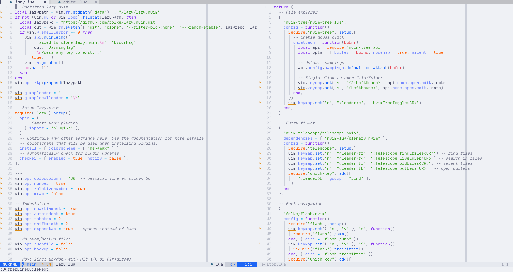

# Neovim configuration





```sh
git clone https://github.com/Matth-L/v_conf ~/
# copy nvim conf
ln -s ~/v_conf/nvim ~/.config/nvim
# copy kitty conf
ln -s ~/v_conf/kitty.conf ~/.config/kitty/kitty.conf
```

## Plugins

## LSP / Formatters
- `lua_ls` — Lua
- `pyright` — Python
- `clangd` — C/C++
- `rust_analyzer` — Rust
- `stylua` — Lua formatter
- `black` — Python formatter
- `clang-format` — C/C++ formatter
- `rustfmt` — Rust formatter
- `prettier` — YAML formatter
